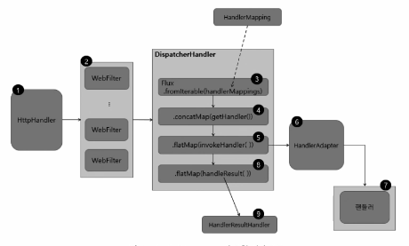
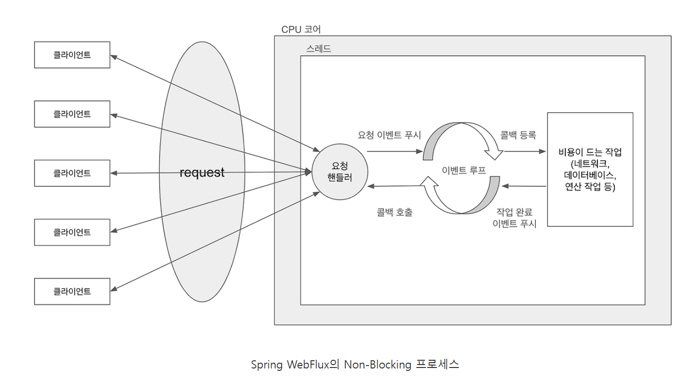

# Spring WebFlux 개요
Spring webflux 와 Spring Mvc의 기술 스택의 비교.

## Spring WebFlux의 탄생배경
* Spring WebFlux는 Spring 5.0에 추가된 새로운 모듈이다.
* 기존의 spring mvc는 서블릿 기반의 blocking I/O로서 대량의 트래픽을 감당하기 힘들어 적은수의 스레드로 높은 처리량을 보여주는 Non-Blocking I/O방식의 Webflux가 탄생하게 되었다.

## Spring Webflux의 기술 스택 차이점
### 서버
* MVC
    * 서블릿 기반의 프레임워크이기 때문에 아파치 톰캣같은 서블릿 컨테이너에서 Blocking I/O방식으로 동작
* Webflux
    * Netty 서버를 사용하여 Non-Blocking I/O방식으로 동작

### 서버 API
* mvc
  * 서블릿 API를 사용
* WebFlux
  * 기본 서버 엔진이 netty이지만 jetty나 undertow같은 리액티브 스트림즈 어댐터를 이용한 스트림즈를 지원

### 보안
* mvc
  * 표준 서블릿 필터를 사용하는 spring security가 서블릿 컨테이너와 통합됨
* WebFlux
  * WebFliter를 이ㅛㅇㅇ해서 Spring Security를 Spring webflux에서 사용

### 데이터 액세스
* mvc
  * Blocking I/O를 사용하는 JDBC, JPA, JMS, JTA등의 데이터 액세스 기술을 사용
* WebFlux
  * Non-Blocking I/O를 사용하는 R2DBC, MongoDB 등의 데이터 액세스 기술을 사용


## Spring webflux의 요청 처리 흐름


1. 요청이 들어오면 Netty 등의 서버 엔진을 거쳐 HttpHandler 가 들어오는 요청을 전달 받음
2. ServerWebExchange 는 WebFilterChain 에서 전처리 과정을 거친 후 WebHandler 인터페이스의 구현체인 DispatcherHandler 에게 전달
3. DispatcherServlet 과 유사한 DispatcherHandler 는 HandlerMapping List 를 원본 Flux 의 소스로 전달 받음
4. ServerWebExchange 를 처리할 핸들러를 조회
5. 조회한 핸들러의 호출은 HandlerAdapter 에게 위임
6. HandlerAdapter 는 ServerWebExchange 를 처리할 핸들러를 호출
7. Controller 또는 HandlerFunction 형태의 핸들러에서 요청을 처리한 후 응답 데이터를 리턴
8. 핸들러로부터 리턴 받은 응답 데이터를 처리할 HandlerResultHandler 를 조회
9. 조회한 HandlerResultHandler 를 통해 response 로 리턴
(HttpHandler는 Netty 이외의 다양한 서버 엔진에서 지원하는 서버 API 를 추상화 하며, ServerHttpRequest, ServerHttpResponse 를 포함하는 ServerWebExchange 를 생성한 후 WebFilterChain 을 통해 전달)


### Spring Webflux의 핵심 컴포넌트
* HttpHandler
HttpHandler는 다른 유형의 Http 서버 API로 request와 response를 처리하기 위해 추상화된 단하나의 메서드만 가진다.
```java
public interface HttpHandler {
    Mono<Void> handle(ServerHttpRequest request, ServerHttpResponse response);
}
```

* HttpWebHandlerAdapter
  * 아래는 HttpHandler의 구현체인 HttpWebHandlerAdapter 클래스 코드 일부
  * handle 메서드에서 ServerWebExchange를 생성하고 HttpHandler의 handle 메서드를 호출
```java
public class HttpWebHandlerAdapter implements WebHandler {
    private final HttpHandler httpHandler;
    public HttpWebHandlerAdapter(HttpHandler httpHandler) {
        this.httpHandler = httpHandler;
    }
    @Override
    public Mono<Void> handle(ServetHttpRequest request, ServerHttpResponse response) {
        // ...
        // ...
        ServerWebExchange exchange = createExchange(request, response);
    }
}
```


* WebFilter
핸들러 요청을 처리하기 전에 전처리 작업을 하도록 해주며, webfliter는 주로 보안이나 세션타임아웃 처리등 애플리케이션에서 공통으로 필요한 전처리에 사용 
```java
public interface WebFilter {
    Mono<Void> filter(ServerWebExchange exchange, WebFilterChain chain);
}
```
파라미터로 전달받은 WebFilterChain을 통해 다음 WebFilter로 전달하거나, 전처리 작업을 수행한 후 WebHandler를 호출할 수 있다.

(webFilter 예제)
```java
public class SampleWebFilter implements WebFilter {
    @Override
    public Mono<Void> filter(ServerWebExchange exchange, WebFilterChain chain) {
        String path = exchange.getRequest().getURI().getPath();
        /**
         * doAfterTerminate()는 종료이벤트(onComplete, onError)발생 시 호출되는 메서드
         */
        return chain.filter(exchange).doAfterTerminate(() -> {
            if (path.startsWith("/api")) {
                System.out.println("api: " + path);
            }
        });
    }
}
```

```kotlin
@Component
class CustomWebFilter: WebFilter {
  override fun filter(exchange: ServerWebExchange, chain: WebFilterChain): Mono<Void> {
    val path = exchange.request.path.value()
    return chain.filter(exchange).doAfterTerminate {
      println("Request path: $path , status : ${exchange.response.statusCode}")
    }
  }
}
```

Spring Webflux는 클라이언트의 요청부터 응답까지 Reactor의 두가지 타입인 mono나 Flux의 Operator체인으로 구성된 하나의 길다란 Sequence라고 생각하면 좀더 쉽게 접근할 수 있다.
따라서 Spring Webflux에서 사용할 수 있는 Filter역시 Reactor Sequence의 일부가 된다는 사실 역시 기억하면 좋다.

* HandlerFilterFunction
함수형 기반의 요청 핸들러에 적용 할 수 있는 Filter로서, WebFilter와 유사하지만 HandlerFilterFunction은 HandlerFunction을 처리하기 전후로 전처리 작업을 수행할 수 있다.
```java
public interface HandlerFilterFunction<T, R> {
    default Mono<R> filter(ServerRequest request, HandlerFunction<T, R> next) {
        return next.handle(exchange);
    }
}
```
HanlderFilterFunction은 filter 메서드로 정의되어 있으며 파리미터로 전달받은 HandlerFunction에 연결된다.

```java
import org.springframework.web.reactive.function.server.ServerRequest;

public class SampleHandlerFilterFunction implements HandlerFilterFunction<ServerRequest, ServerResponse> {
    @Override
    public Mono<ServerResponse> filter(ServerRequest request, HandlerFunction<ServerRequest, ServerResponse> next) {
        String path = request.requestPath().value();
        
        return next.handle(request).doAfterTerminate(() -> {
            if (path.startsWith("/api")) {
                System.out.println("api: " + path);
            }
        });
    }
}
```

```kotlin
class HandlerFilter: HandlerFilterFunction<ServerResponse, ServerResponse> {
    override fun filter(request: ServerRequest, next: HandlerFunction<ServerResponse>): Mono<ServerResponse> {
       val path = request.requestPath().value()

        return next.handle(request).doAfterTerminate {
            println("Request path: $path , status : ${request.exchange().response.statusCode}")
        }
    }
}
```

WebFilter의 구현체는 SpringBean으로 등록되는 반면 HandlerFilterFunction은 RouterFunction에 등록되어 사용된다.(함수형 기반의 요청핸들러)
따라서 Spring Bean으로 등록되지 않는다.


#### 차이점
* Webfilter
  * 애플리케이션 내 정의된 모든 핸들러에 공통적으로 동작한다. 따라서 애너테이션 기반 요청 핸들러와 함수형 기반의 요청 핸들러에서 모두 동작
* HandlerFilterFunction
  * 함수형 기반의 요청 핸들러에만 동작한다. 함수형 기분의 핸들러에서만 제한적으로 필터링 작업을 수행하고 싶다면 HandlerFilterFunction을 사용


#### DispatcherHandler
DispatcherHandler는 WebHandler 인터페이스의 구현체로서 Spring MVC에서 Front Controller 패턴이 적용된 DispatcherServlet과 유사하게 중앙에서 먼저 요청을 전달 받은 후 다른 컴포넌트에 요청 처리를 위임함.
DispatcherHandler 자체가 SpringBean 이며 ApplicationContext에서 HandlerMapping, HandlerAdapter, HandlerResultHandler등의 요청 처리를 위한 위임 컴포넌트를 검색함.

아래는 DispatcherHandler의 일부 코드이다.
```java
public class DispatcherHandler implements WebHandler, PreFlightRequestHandler, ApplicationContextAware {
    @Nullable
    private List<HandlerMapping> handlerMappings;
    @Nullable
    private List<HandlerAdapter> handlerAdapters;
    @Nullable
    private List<HandlerResultHandler> resultHandlers;

    public DispatcherHandler() {
    }

    public DispatcherHandler(ApplicationContext applicationContext) {
        this.initStrategies(applicationContext);
    }

    @Nullable
    public final List<HandlerMapping> getHandlerMappings() {
        return this.handlerMappings;
    }

    public void setApplicationContext(ApplicationContext applicationContext) {
        this.initStrategies(applicationContext);
    }

    protected void initStrategies(ApplicationContext context) {
        Map<String, HandlerMapping> mappingBeans = BeanFactoryUtils.beansOfTypeIncludingAncestors(context, HandlerMapping.class, true, false);
        ArrayList<HandlerMapping> mappings = new ArrayList(mappingBeans.values());
        AnnotationAwareOrderComparator.sort(mappings);
        this.handlerMappings = Collections.unmodifiableList(mappings);
        Map<String, HandlerAdapter> adapterBeans = BeanFactoryUtils.beansOfTypeIncludingAncestors(context, HandlerAdapter.class, true, false);
        this.handlerAdapters = new ArrayList(adapterBeans.values());
        AnnotationAwareOrderComparator.sort(this.handlerAdapters);
        Map<String, HandlerResultHandler> beans = BeanFactoryUtils.beansOfTypeIncludingAncestors(context, HandlerResultHandler.class, true, false);
        this.resultHandlers = new ArrayList(beans.values());
        AnnotationAwareOrderComparator.sort(this.resultHandlers);
    }

    public Mono<Void> handle(ServerWebExchange exchange) {
        if (this.handlerMappings == null) {
            return this.createNotFoundError();
        } else {
            return CorsUtils.isPreFlightRequest(exchange.getRequest()) ? this.handlePreFlight(exchange) : Flux.fromIterable(this.handlerMappings).concatMap((mapping) -> {
                return mapping.getHandler(exchange);
            }).next().switchIfEmpty(this.createNotFoundError()).flatMap((handler) -> {
                return this.invokeHandler(exchange, handler);
            }).flatMap((result) -> {
                return this.handleResult(exchange, result);
            });
        }
    }

    private <R> Mono<R> createNotFoundError() {
        return Mono.defer(() -> {
            Exception ex = new ResponseStatusException(HttpStatus.NOT_FOUND, "No matching handler");
            return Mono.error(ex);
        });
    }

    private Mono<HandlerResult> invokeHandler(ServerWebExchange exchange, Object handler) {
        if (ObjectUtils.nullSafeEquals(exchange.getResponse().getStatusCode(), HttpStatus.FORBIDDEN)) {
            return Mono.empty();
        } else {
            if (this.handlerAdapters != null) {
                Iterator var3 = this.handlerAdapters.iterator();

                while(var3.hasNext()) {
                    HandlerAdapter handlerAdapter = (HandlerAdapter)var3.next();
                    if (handlerAdapter.supports(handler)) {
                        return handlerAdapter.handle(exchange, handler);
                    }
                }
            }

            return Mono.error(new IllegalStateException("No HandlerAdapter: " + handler));
        }
    }

    private Mono<Void> handleResult(ServerWebExchange exchange, HandlerResult result) {
        return this.getResultHandler(result).handleResult(exchange, result).checkpoint("Handler " + result.getHandler() + " [DispatcherHandler]").onErrorResume((ex) -> {
            return result.applyExceptionHandler(ex).flatMap((exResult) -> {
                String text = "Exception handler " + exResult.getHandler() + ", error=\"" + ex.getMessage() + "\" [DispatcherHandler]";
                return this.getResultHandler(exResult).handleResult(exchange, exResult).checkpoint(text);
            });
        });
    }

    private HandlerResultHandler getResultHandler(HandlerResult handlerResult) {
        if (this.resultHandlers != null) {
            Iterator var2 = this.resultHandlers.iterator();

            while(var2.hasNext()) {
                HandlerResultHandler resultHandler = (HandlerResultHandler)var2.next();
                if (resultHandler.supports(handlerResult)) {
                    return resultHandler;
                }
            }
        }

        throw new IllegalStateException("No HandlerResultHandler for " + handlerResult.getReturnValue());
    }

    public Mono<Void> handlePreFlight(ServerWebExchange exchange) {
        return Flux.fromIterable(this.handlerMappings != null ? this.handlerMappings : Collections.emptyList()).concatMap((mapping) -> {
            return mapping.getHandler(exchange);
        }).switchIfEmpty(Mono.fromRunnable(() -> {
            exchange.getResponse().setStatusCode(HttpStatus.FORBIDDEN);
        })).next().then();
    }
}

```
initsStrategies 메서드는 ApplicationContext에서 HandlerMapping, HandlerAdapter, HandlerResultHandler등의 컴포넌트를 검색하여 설정한다.
DispatcherHandler는 HandlerMapping, HandlerAdapter, HandlerResultHandler등의 컴포넌트를 검색하여 요청을 처리하며, HandlerMapping은 요청을 처리할 핸들러를 조회하고, HandlerAdapter는 핸들러를 호출하고, HandlerResultHandler는 핸들러로부터 리턴받은 응답 데이터를 처리한다.


### Spring Webflux의 Non-Blocking 프로세스 구조
Spring Mvc와 Webflux는 동시성 모델과 스레드에 대한 기본전략에서 차이점이 있다.
Blocking I/O 방식의 MVC는 요청을 처리하는 스레드가 차단될 수 있기 때문에 기본적으로 대용량의 스레드 풀을 사용해서 하나의 요청을 하나의 스레드가 처리,
반면 Non-Blocking I/O 방식의 Spring Webflux는 스레드가 차단되지 않기때문에 적은 수의 고정된 스레드 풀을 사용해서 더많은 요청을 처리하며 이벤트 루프방식을 사용한다.


1. 클라이언트로부터 들어오는 요청을 핸들러가 전달 받음
2. 전달받은 요청을 이벤트 루프에 푸시
3. 이벤트 루프는 요청에 대한 작업을 처리
4. 작업이 완료되면 완료이벤트를 이벤트 루프에 푸시
5. 등록한 콜백을 호출해 처리결과 전달.

### Spring webflux의 스레드 모델
Spring Webflux는 Non-blocking I/O 를 지웒하는 Netty 등의 서버 엔진에서  적은 수의 고정된 크기의 스레드(일반적으로 cpu 코어 개수만큼의 스레드 생성)로 높은 처리량을 보여줄 수 있다.
(Reactor Netty에서는 CPU 코에의 개수가 4보다 작은 경우 최소 4개의 워커 스레드 생성하며 4보다 많으면 코어 개수만큼의 스레드를 생성한다.)

하지만, 서버측에서 복잡한 연산을 처리하는 등의 CPU 집약적인 작업을 하거나, 클라이언트의 요청부터 응답 처리 전 과정안에 Blocking 되는 지점이 존재한다면
오히려 성능이 저하될수 있다. 이를 보완하고자 클라이언트의 요청을 처리하기 위해 서버 엔진에서 제공하는 스레드 풀이 아닌 다른 스레드 풀을 사용할 수 있는 메커니즘을 제공 하는데 그것이 지난 챕터의 스케쥴러 이다.

#### 애너테이션 기본 컨트롤러
* 기존 mvc 에너테이션 기반의 컨트롤러에서 Mono 타입을 리턴한다는 점 외에 달라진것은 없다


```
Spring Webflux는 spring mvc에서 지원하던 @ResponseBody 애너테이션과 ResponseEntity 타입을 그대로 지원.
Spring MVC와의 차이점은 리액티브 타입을 이용해 데이터를 비동기적으로 response body에 렌더링 되도록 한다는점이다.
```


#### 함수형 엔드포인트
```
Spring WebFlux는 기존의 애너테이션 기반 프로그래밍 모델과 함께 함수형 엔드포인트를 기반으로 하는 새로운 프로그래밍 모델을 지원.
함수형 엔드포인트에서는 들어오는 요청을 라우팅하고, 라우팅된 요청을 처리하며 결과 값을 응답으로 리턴하는 등의 모든 작업을 하나의 함수 체인에서 처리함.
```

함수형 엔드포인트는 요청을 처리하기위해 HandlerFunction 이라는 함수형 기반의 핸들러를 사용한다.
이는 요청 처리를 위한 ServerRequest 하나만 handle 메서드에 전달받아 처리하고 ServerResponse를 리턴한다.

* ServerRequest
HandlerFunction 에 의해 처리되는 HTTP request를 표현함 따라서 HttpHeaders, method, URI, query parameter, request body 등의 정보를 포함한다.
* ServerResponse
HandlerFunction 에 의해 생성된 HTTP response를 표현함. 따라서 HTTP status code, headers, body 등의 정보를 포함한다.

Request 라우팅을 위한 RouterFunction
RouterFunction은 HandlerFunction을 라우팅하기 위한 함수형 인터페이스이다.(@ReuqestMapping 애너테이션과 동일한 기능을 한다.)
RouterFUnction은 요청을 위한 데이터 뿐만 아니라 요청 처리를 위한 동작가지 RouterFunction 의 파라미터로 제공한다는 차이점이 있음.


### 함수형 엔드포인트에서의 request body 유효성 검증
함수형 엔드포인트는 Spring의 validator 인터페이스를 구현한 Custom Validator 을 이용해서 request body에 유효성 검증을 적용할 수 있음

```kotlin
@Component("bookValidator")
class BookValidator: Validator {
    override fun supports(clazz: Class<*>): Boolean {
        return Book::class.java.isAssignableFrom(clazz)
    }

    override fun validate(target: Any, errors: org.springframework.validation.Errors) {
        val book = target as Book
        if (book.title.isBlank()) {
            errors.rejectValue("title", "title.empty")
        }
    }
}


@Service
class Handler(
  val bookValidator: BookValidator,
  val bookRepository: BookRepository
) {
  fun createBook(
    serverRequest: ServerRequest
  ): Mono<ServerResponse> {
    println("Creating a book")
    return serverRequest.bodyToMono(Book::class.java)
      .doOnNext { it -> validate(it) } // 유효성 검증을 위해 주입받은 BookValidator 를 이용해 doOnNext에서 validate 메서드를 호출
      .flatMap { bookRepository.createBook(it) }
      .flatMap { ServerResponse.ok().build() }

    /**
     * Spring webflux에서는 유효성 검증을 진행하는 로직 역시 Operator 체인 안에서 진행됨.
     */
  }
  
  ... 

  /**
   * 유효성 검증을 위한 함수
   */
  fun validate(book: Book) {
    val errors = Book::class.simpleName?.let { BeanPropertyBindingResult(book, it) }
    bookValidator.validate(book, errors!!)

    if (errors.hasErrors()){
      throw ServerWebInputException(errors.toString())
    }
  }
}

```

Spring webflux에서는 유효성 검증을 진행하는 로직 역시 Operator 체인 안에서 진행한다.


## Spring Data R2DBC
R2DBC는 관계형 데이터베이스에 리액티브 프로그래밍 API를 제공하기 위한 개방형 사양 이면서, 드라이버 벤더가 구현하고 클라이언트가 사용하기 위한 SPI(Service Provider Interface)다.

### Spring Data R2DBC
 Spring Data R2DBC는 R2DBC 기반 Repository를 좀더 쉽게 구현하게 해주는 Spring Data Family의 일원이며 Spring이 추구하는 추상화 기법이 적용되어 있다.
 Spring Data R2DBC는 JPA같은 ORM 프레임워크에서 제공하는 캐싱, 지연로딩, 기타 ORM 프레임워크에서 가지고 있는 특징들이 제거되어 단순하고 심플하다.
 또한 보일러 플레이트 코드의 양을 대폭 줄일 수 있다.
 

### R2DBC Repository를 이용한 데이터 액세스
Spring Data R2dbc 는 Repository를 지원합니다.
```kotlin
@Repository
interface BookRepositoryR2dbc: ReactiveCrudRepository<BookEntity, Long> {
    fun findByIsbn(isbn: String): Mono<BookEntity>
}
```

## R2DBC EntityTemplate

Spring Data R2dbc 외에도 가독성 좋은 SQL 쿼리문을 작성하는것과 같은 자연스러운 방식으로
메서드를 조합하여 데이터베이스와 인터랙션 할 수 있는 R2dbcEntityTemplate를 제공한다.

```
템플릿/콜백 패턴이 적용된 JdbcTemplate처럼 R2dbcEntityTemplate 역시 템플릿을 사용한다.
R2dbcEntityTemplate은 JPA 기술에 사용되는 Query DSL과 유사한 방식은 Query 생성 메서드 조합과
Entity 객체를 템플릿에 전달하여 데이터베이스와 인터랙션 한다.
```

```kotlin
@Service
class EntityTemplateHandler(
    val r2dbcEntityTemplate: R2dbcEntityTemplate
) {
    fun createBook(bookEntity: BookEntity) {
        verifyExitIsbn(bookEntity.isbn)
            .doOnNext { r2dbcEntityTemplate.insert(bookEntity) }
    }

    fun updateBook(bookEntity: BookEntity) {
        findVerifiedBook(bookEntity.isbn)
            .doOnNext { r2dbcEntityTemplate.update(bookEntity) }
    }
    
    fun findBooks(): Mono<List<BookEntity>> {
        return r2dbcEntityTemplate.select(BookEntity::class.java).all().collectList()
    }

    private fun verifyExitIsbn(isbn: String): Mono<Unit> {
        return r2dbcEntityTemplate.selectOne(Query.query(where("isbn").`is`(isbn)), BookEntity::class.java)
            .flatMap { isbn ->
                if (isbn != null) {
                    Mono.error(RuntimeException("ISBN already exists"))
                } else {
                    Mono.empty()
                }
            }
    }

    private fun findVerifiedBook(isbn: String): Mono<BookEntity> {
        return r2dbcEntityTemplate.selectOne(Query.query(where("isbn").`is`(isbn)), BookEntity::class.java)
            .switchIfEmpty(Mono.error(RuntimeException("ISBN NOT exists")))
    }
}
```
* selectOne 메서드는 한 건의 데이터를 조회하는데 사용되며, query객체와 엔티티 클래스의 class 객체를 파라미터로 가진다.
* where 메서드는 sql쿼리 문에서 where 절을 표현하는 creteria객체이다
* is 메서드는 sql 쿼리문에서 equal을 표현한다.
* select 메서드는 sql 쿼리문에서 select 절을 표현하며, from(), as(), one(), all() 등의 종료 메서드와 함께 사용 된다.

```
R2dbcEntityTemplate은 SQL 쿼리문의 시작구문인 SELECT, INSERT, UPDATE, DELETE 등에 해당되는 select(), insert(), update(), delete() 메서드를 Entrypoint method라고 한다.
all(), count(), one() 등의 메서드처럼 sql 문을 생성하고 최종적으로 sql문을 실행하는 메서드를 terminating method 라고 부른다.
```

### terminating method
* first(): 첫 번째 행만 소비하고 Mono를 반환합니다. 쿼리가 결과를 반환하지 않으면 반환된 Mono는 객체를 방출하지 않고 완료됩니다.
* one(): 정확히 한 행을 소비하고 Mono를 반환합니다. 쿼리가 결과를 반환하지 않으면 반환된 Mono는 객체를 방출하지 않고 완료됩니다. 쿼리가 두 개 이상의 행을 반환하면 Mono는 IncorrectResultSizeDataAccessException을 방출하며 예외적으로 완료됩니다.
* all(): 반환된 모든 행을 소비하고 Flux를 반환합니다.
* count(): 카운트 프로젝션을 적용하여 Mono<Long>을 반환합니다.
* exists(): 쿼리가 행을 반환하는지 여부를 Mono<Boolean>으로 반환합니다.

### criteria method
* and(Stirng column): Sql 쿼리문에서 and 연산자에 해당되며 컬럼명에 해당하는 criteria를 추가한 새로운 criteria를 리턴한다.
* or(String column): Sql 쿼리문에서 or 연산자에 해당되며 컬럼명에 해당하는 criteria를 추가한 새로운 criteria를 리턴한다.
* greaterThan(Object value): Sql 쿼리문에서 > 연산자에 해당되며 value보다 큰 값을 가지는 criteria를 리턴한다.
* greaterThanOrEquals(Object value): Sql 쿼리문에서 >= 연산자에 해당되며 value보다 크거나 같은 값을 가지는 criteria를 리턴한다.
* in(Object... values): Sql 쿼리문에서 in 연산자에 해당되며 values에 해당하는 값을 가지는 criteria를 리턴한다.
* in(collection<?> values): Sql 쿼리문에서 in 연산자에 해당되며 values에 해당하는 값을 가지는 criteria를 리턴한다.
* isNull(): Sql 쿼리문에서 is null 연산자에 해당되며 null 값을 가지는 criteria를 리턴한다.
* isNotnull(): Sql 쿼리문에서 is not null 연산자에 해당되며 null이 아닌 값을 가지는 criteria를 리턴한다.
* lessThan(Object value): Sql 쿼리문에서 < 연산자에 해당되며 value보다 작은 값을 가지는 criteria를 리턴한다.
* lessThanOrEquals(Object value): Sql 쿼리문에서 <= 연산자에 해당되며 value보다 작거나 같은 값을 가지는 criteria를 리턴한다.
* like(String value): Sql 쿼리문에서 like 연산자에 해당되며 value와 일치하는 값을 가지는 criteria를 리턴한다.
* not(Object o): Sql 쿼리문에서 not 연산자에 해당되며 not 연산을 수행하는 criteria를 리턴한다.
* notIn(Object... values): Sql 쿼리문에서 not in 연산자에 해당되며 values에 해당하지 않는 값을 가지는 criteria를 리턴한다.
* notIn(Collection<?> values): Sql 쿼리문에서 not in 연산자에 해당되며 values에 해당하지 않는 값을 가지는 criteria를 리턴한다.

### SpringDate R2dbc 에서의 페이지네이션 처리
Spring Data R2dbc에서 데이터 액세스를 위해 Repository를 이용할 경우, 페이지네이션 처리는 다른 Spring Data 패밀리 프로젝트에서의 
페이지네이션 처리와 별반 다를게 없다.


#### R2dbcRepository
```kotlin
@Repository
interface BookRepositoryR2dbc: ReactiveCrudRepository<BookEntity, Long> {
    ...

    fun findAllBy(pageable: Pageable): Flux<BookEntity>
}
```

```kotlin

@Service
class R2dbcRepositoryBookHandler(
  val bookValidator: BookValidator,
  val bookRepositoryR2dbc: BookRepositoryR2dbc
) {
  fun findBooks(serverRequest: ServerRequest): Mono<ServerResponse> {
    val bookDto = serverRequest.bodyToMono(BookDto::class.java)
    return bookDto.flatMap { dto ->
      ServerResponse.ok().body(
        bookRepositoryR2dbc.findAllBy(PageRequest.of(dto.page - 1, dto.size, Sort.by("bookId"))).collectList(),
        BookEntity::class.java
      )
    }
  }
}

```


#### R2dbcEntityTemplate

```kotlin
@Service
class EntityTemplateHandler(
    val r2dbcEntityTemplate: R2dbcEntityTemplate
) {
  fun findBooks(page: Long, size: Long): Mono<List<BookEntity>> {
    return r2dbcEntityTemplate
      .select(BookEntity::class.java)
      .count()
      .flatMap { total ->
        val skipAndTake = getSkipAndTake(total, page, size)
        r2dbcEntityTemplate
          .select(BookEntity::class.java)
          .all()
          .sort()
          .skip(skipAndTake.t1)
          .take(skipAndTake.t2)
          .collectList()
      }
  }

  private fun getSkipAndTake(total: Long, movePage: Long, size: Long): Tuple2<Long, Long> {
    val totalPages = Math.ceil(total.toDouble() / size).toLong()
    val page = if (movePage > totalPages) totalPages else movePage
    val skip = if (total - (page * size) < 0) 0 else total - (page * size)
    val take = if (total - (page * size) < 0) total - ((page - 1) * size) else size

    return Tuples.of(skip, take)
  }
}
```
1. R2dbcEntityTemplate의 경우 먼저 count() operator로 저장된 도서의 총 개수를 구한뒤에 flatmap operator 내부에서
페이지 네이션 처리를 수행한다.
2. skip() 은 findbooks 의 파라미터로 전달받은 페이지의 시작 지점으로 이동하기 위해 페이지 수만큼 emit된 데이터를 건너뛰는 역할을 수행한다.
3. take() operator는 findbooks의 파라미터로 전달받은 페이지의 데이터 개수만큼 데이터를 가져오는 역할을 수행한다.
4. getSkipAndTake() 메서드는 총 데이터 개수, 이동할 페이지, 페이지 당 데이터 개수를 파라미터로 받아 skip과 take 값을 계산하여 Tuple2로 리턴한다.

## 예외 처리
### onErrorResume을 이용한 예외처리
onErrorResume() 은 에러이벤트가 발생했을때 **에러 이벤트를 Downstream으로 전파하지 않고** 대체 Publisher를 통해
에러 이벤트에 대한 대체값을 emit하거나 발생한 에러 이벤트를 래핑한 후 emit하는 방식으로 에러를 처리한다.
```kotlin
fun createBook(
        serverRequest: ServerRequest
    ): Mono<ServerResponse> {
        println("Creating a book")
        return serverRequest.bodyToMono(BookEntity::class.java)
            .doOnNext { it -> validate(it) } // 유효성 검증을 위해 주입받은 BookValidator 를 이용해 doOnNext에서 validate 메서드를 호출
            .flatMap {
                bookRepositoryR2dbc.save(it)
            }
            .flatMap { ServerResponse.ok().build() }
            .onErrorResume(IllegalArgumentException::class.java) { illegalArgumentException ->
                ServerResponse.badRequest().bodyValue(ErrorResponse(HttpStatus.BAD_REQUEST, illegalArgumentException.message!!))
            }
            .onErrorResume(Exception::class.java) { exception ->
                ServerResponse.unprocessableEntity().bodyValue(ErrorResponse(HttpStatus.INTERNAL_SERVER_ERROR, exception.message!!))
            }
        /**
         * Spring webflux에서는 유효성 검증을 진행하는 로직 역시 Operator 체인 안에서 진행됨.
         */
    }
```


### ErrorWebExceptionHandler를 이용한 예외 처리
onErrorResume등의 operator를 이용한 예외처리는 사용하기 간편하나, 클래스 내에 여러개의 sequence가 존재하면 각 sequence마다 onErrorResume을 적용해야 하므로 중복 코드가 발생할 수 있다.
이러한 문제를 해결하기 위해 Spring Webflux는 ErrorWebExceptionHandler를 제공한다.

```kotlin

@Order(-2) // DefaultErrorWebExceptionHandler bean의 우선순위 (-1) 보다 높은 우선순위인 -2를 지정합니다.
@Configuration
class GlobalWebExceptionHandler(
    private val objectMapper: ObjectMapper
): ErrorWebExceptionHandler {
    val log = org.slf4j.LoggerFactory.getLogger(this::class.java)

    override fun handle(exchange: ServerWebExchange, ex: Throwable): Mono<Void> {
        return handleException(exchange, ex)
    }

    fun handleException(serverWebExchange: ServerWebExchange, ex: Throwable): Mono<Void> {
        val bufferFactory: DataBufferFactory = serverWebExchange.response.bufferFactory()
        serverWebExchange.response.headers.contentType = MediaType.APPLICATION_JSON

        log.error("Error: ", ex)

        val (status, message) = when (ex) {
            is IllegalArgumentException -> HttpStatus.BAD_REQUEST to ex.message
            is ResponseStatusException -> ex.status to ex.reason
            else -> HttpStatus.INTERNAL_SERVER_ERROR to ex.message
        }

        val errorResponse = ErrorResponse(status, message)
        serverWebExchange.response.statusCode = status

        val dataBuffer = try {
            bufferFactory.wrap(objectMapper.writeValueAsBytes(errorResponse))
        } catch (e: Exception) {
            bufferFactory.wrap(ByteArray(0))
        }

        return serverWebExchange.response.writeWith(Mono.just(dataBuffer))
    }
}

```
ErrorWebExceptionHandler 외에 AbstractErrorWebExceptionHandler를 상속받아 구현할 수도 있다
이는 이미 구현되어있으며, 메서드 몇개만 오버라이드해서 구현할수 있어 간편하다

ex)
```kotlin

@Order(-2)
@Component
class MyExceptionHandler(
  errorAttributes: ErrorAttributes,
  applicationContext: ApplicationContext,
  codecConfigurer: ServerCodecConfigurer,
) : AbstractErrorWebExceptionHandler(errorAttributes, WebProperties.Resources(), applicationContext) {

  init {
    this.setMessageWriters(codecConfigurer.writers)
    this.setMessageReaders(codecConfigurer.readers)
  }


  override fun getRoutingFunction(errorAttributes: ErrorAttributes): RouterFunction<ServerResponse> {
    return RouterFunctions.route(RequestPredicates.all()) { request: ServerRequest ->
      val errorProps = getErrorAttributes(request, false)
      ServerResponse
        .status(HttpStatus.INTERNAL_SERVER_ERROR)
        .contentType(MediaType.APPLICATION_JSON)
        .bodyValue(mapOf("error" to errorProps["message"]))
    }
  }
}
```